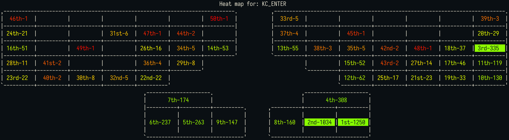

# `orxy-stats`

This is a simple tool that can do the following:

* download all layouts (with their keymaps) from Oryx
* print a given layout to the terminal
* search for a particular key, and print a heatmap of where that key across all the downloaded layouts



## Usage

First, download and install the dependencies:

```bash
# Clone the repository
git clone https://github.com/acheronfail/oryx-stats
cd oryx-stats

# Install dependencies
yarn install
```

Now, please inspect `options.ts` and see if you want to change any of the options.

**Download and generate a heatmap for a given key:**

```bash
# If you're happy to proceed, then scrape all the layouts, and print a heat map to the terminal:
yarn start
```

**Print all layers of a layout to the terminal:**

```bash
# Put the hash id of the chosen layout in `options.ts`
yarn print-layout
```

## Known Issues

* only supports the `moonlander` geometry
* If two key positions have the same count, they're not ranked equally, but in the order they were found (not a big deal)
* When printing the layers to the terminal (`yarn print-keymap`) "transparent" keys (keys which fall through the the previous layer) aren't calculated 100% accurately. This is because it depends on which layer you switched from, not the layer immediately underneath it